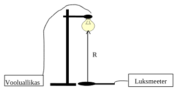

```{r setup, include=FALSE}
knitr::opts_chunk$set(echo = TRUE)
```

## Töö eesmärgid

1.  Valgusallika valgustugevuse hindamine.

2.  Statistilise andmetöötluse meetoditega tutvumine.

## Töövahendid:

Mobiiltelefon, app Lux Meter (Light Meter).

## Töö käik:

Valgusallikate valgusviljakuse või nende heleduse (täpsemalt - nende poolt kiiratava valguskiirguse intensiivsuse) hindamiseks kasutatakse füüsikalist suurust - valgustugevus. LED-lambi, hõõglambi pirnidel pakenditel võib leida märkusi - 470 lm, 900 lm, 200 lm (lm - luumen). Kuigi hõõglambi ning LED-lambi valgustugevused ei ole otseselt võrreldavad - nende pirnide ehitus on erinev, valgusspekter on erinev - siis valgustugevus annab mingi info, kuidas saaks erinevaid lambipirne üksteisega võrrelda.

Lambi valgustugevus on seotud otseselt lambi all oleva tööpinna valgustatusega. Viimast mõõdetakse luksides. Tervisekaitse on kindlaks määranud normid, millele peaks vastama tööpinnad erinevates ruumides, sh auditooriumites ja nt kirjutuslaudadel (nt raamatukogus).

Antud töös hindame lambi valgustugevust kasutades mõõteriistana mobiiltelefoni appi Lux Meter (või Light Meter vmt).

Lamp valgustugevusega *I* tekitab pinnal, mis on temast kaugusel *r* ning risti vaatesuunaga, valgustatuse *E*. Need on seotud omavahel vastavalt seosele:

$$E=\frac{I}{R^{2}}$$

Seega peaks punktikujulise valgusallika korral valgustatuse sellest eemdaldumisel kahanema vastavalt pöördruutsõltuvuse seosele. Selleks, et määrata valgustugevust, tuleb püstitada katse vastavalt alltoodud joonisele:



Ei LibreOffice ega ka MS Excel luba x-y andmepaaridele sobitada pöördruutsõltuvust. Selleks, et ikkagi leida nende andmetöötlusprogrammide abil valgustugevust, tuleb võtta uus muutuja $x = 1/R^{2}$. Siis saame algsest seosest

$$E=\frac{I}{R^{2}}+E_{0}=I\cdot x+E_{0}=k\cdot x+b,$$

kus *E~0~* tähistab taustvalgustatust (tingitud teiste valgusallikate olemasolust ruumis).

Seega tuleb 8-l erineval kaugusel tuleb mõõta valgustatus mobiiltelefoniga ning kanda järgmisse tabelisse.

```{r}
distance = c("", "", "", "", "", "", "", "")

xForLight = c("", "", "", "", "", "", "", "")

lighting = c("", "", "", "", "", "", "", "")

dataframeForLighting = data.frame(distance = distance, xForLight = xForLight, lighting = lighting)

colnames(dataframeForLighting) = c("Kaugus $R (m)$.", "$x = 1/R^{2}$", "Valgustatus $E$ (lx). (ehk y)")
library(kableExtra)
dataframeForLighting %>% kbl(caption = "Valgustatuse mõõtmised") %>% kable_styling(bootstrap_options = c("striped", "hover"))

```

Andmetöötluse jaoks peavad kaugused olema kas kasvavas või kahanevas järjekorras, kuid mitte segiläbi.

Tabelarvutusprogrammiga tuleb nüüd teha kaks graafikut: *E* sõltuvus kaugusest *R* ning *E* sõltuvus *x*-st. E vs x järgi tuleb leida slope *k*, mis ongi arvuliselt võrdne valgustugevusega *I*. Vabaliige *b* ei tohiks olla negatiivne. Kui see täielikult pimendatud ruumi korral on nullile lähedal (kuigi ehk negatiivne), siis on see nö normaalne juhuslikkusest tingitud kõrvalekalle. Kui on suur ja negatiivne, siis on tingitud mõõtevahendite süstemaatilisest veast.

Funktsiooni Linest abil on võimalik leida ka valgustugevuse standardhälve ning selle kaudu ka mõõtemääramatus.

Kui võimalik, hinnake, kas leitud lambi valgustugevus võiks olla normaalne.

## Lahendus

Teostasin mõõtmised kasutades mõõdupulka ja CLAS OHLSONi valgusmõõturit *1300*. Mõõtmistulemused on tabelis \@ref(tab:tableOfMeasurements).

```{r tableOfMeasurements}
distance = c(.2, .4, .6, .8, 1, 1.2, 1.4, 1.6)

xForLight = sapply(distance, function(distance) 1 / distance ^ 2)

lighting = c(6600, 2300, 810, 260, 30, 80, 70, 50)

dataframeForLighting = data.frame(distance = distance, xForLight = xForLight, lighting = lighting)

colnames(dataframeForLighting) = c("Kaugus $R (m)$.", "$x = 1/R^{2}$", "Valgustatus $E$ (lx). (ehk y)")

dataframeForLighting %>% kbl(caption = "Valgustatuse mõõtmised") %>% kable_styling(bootstrap_options = c("striped", "hover"))

```
Valgustatuse sõltuvus kaugusest on esitatud graafikul \@ref(fig:graphForDistance).

```{r graphForDistance, fig.cap="Valgustatuse sõltuvus kaugusest"}
library(ggplot2)
ggplot(data = dataframeForLighting, mapping = aes(x = distance, y = lighting)) +
  labs(x = paste("Kaugus ", expression(R (m))), y = paste("Valgustatus ", expression(E), "  (lx). (ehk y)"), title = paste(expression(E), " sõltuvus kaugusest ", expression(R))) +
  geom_point() +
  geom_line()
```

Valgustatuse sõltuvus kauguse ruudu pöördväärtusest on esitatud graafikul \@ref(fig:graphForDistanceInverseSquared).

```{r graphForDistanceInverseSquared, fig.cap="Valgustatuse sõltuvus kauguse ruudu pöördväärtusest"}
library(ggplot2)
ggplot(data = dataframeForLighting, mapping = aes(x = xForLight, y = lighting)) +
  labs(y = paste("Valgustatus ", expression(E), "  (lx). (ehk y)"), x = expression(x = 1/R^{2}), title = paste(expression(E), " sõltuvus ", expression(x), "-st"))+
  geom_point() +
  geom_line()
```

Graafikul \@ref(fig:graphForDistanceWithAbline) on esitatud valgustatuse sõltuvus kauguse ruudu pöördväärtusest lineaarse trendijoonega.

```{r graphForDistanceWithAbline, fig.cap="Valgustatuse sõltuvus kauguse ruudu pöördväärtusest lineaarse trendijoonega"}
lmForLighting = lm(lighting ~ xForLight, data = dataframeForLighting)
lmForLighting
library(ggplot2)
ggplot(data = dataframeForLighting, mapping = aes(x = xForLight, y = lighting)) +
  labs(y = paste("Valgustatus ", expression(E), "  (lx). (ehk y)"), x = expression(x = 1/R^{2}), title = paste(expression(E), " sõltuvus ", expression(x), "-st"))+
  geom_point() +
  geom_line() +
  geom_abline(intercept = lmForLighting$coefficients[1], slope = lmForLighting$coefficients[2], color = "green")
```

Selle trendijoone tõus on `r format(lmForLighting$coefficients[2], digits = 2)`. Vabaliige `r format(lmForLighting$coefficients[1], digits = 2)` on negatiivne, kuna mõõtmistulemustes eksisteerib kauguse üks meeter kohta väärtus 30 luksi, sest mõõtsin selle väärtuse teises suunas võrreldes muude väärtustega.

Mõõteseadme kasutusjuhendis [@luxmeter] on kirjas soovitatud valgustugevused eri funktsionaalsuste jaoks. Mõõtmise ajal oli lamp .8 m kõrgusel kirjutuslauast. Sellise kauguse puhul mõõtsin valgustugevuseks 260 luksi. Vastavalt kasutusjuhendis olevale teabele soovitatakse sellist valgustugevust konverentsiruumi, vastuvõttu, pakkimiseks, üldruumi, käimlasse, kassasse, trepikotta, palatisse, kolikambrisse, spordisaali, jutlussaali, klassiruumi. Kontoritööks jääb sellest väheseks ja selle jaoks on vajalik lamp vähemalt .2 m allapoole ehk kirjutuslauale lähemale tirida.
